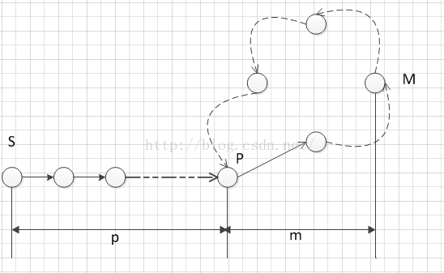

分析参见 https://blog.csdn.net/javasus/article/details/50015687

假定当前链表如下：

初始状态下，假设已知某个起点节点为节点S。
现设两个指针t和h，将它们均指向S。

接着，同时让t和h往前推进，但是二者的速度不同：t每前进1步，h前进2步。只要二者都可以前进而且没有相遇，就如此保持二者的推进。当h无法前进，即到达某个没有后继的节点时，就可以确定从S出发不会遇到环。反之当t与h再次相遇时，就可以确定从S出发一定会进入某个环，设其为环C。

如果确定了存在某个环，就可以求此环的起点与长度。

### 计算环长度

上述算法刚判断出存在环C时，显然t和h位于同一节点，设其为节点M。显然，仅需令h不动，而t不断推进，最终又会返回节点M，统计这一次t推进的步数，显然这就是环C的长度。

### 计算环起点

为了求出环C的起点，只要令h仍位于节点M，而令t返回起点节点S。随后，同时让t和h往前推进，且保持二者的速度相同：t每前进1步，h前进1步。持续该过程直至t与h再一次相遇，设此次相遇时位于同一节点P，则节点P即为从节点S出发所到达的环C的第一个节点，即环C的一个起点。

链表起点为节点S，环起点为节点P，t和h相遇时位于同一节点M，S和P之间的距离为p，P和M之间的距离为m，环长为C，这里两点之间的距离是指从一点走多少步可以到点另外一点。

当t和h相遇时，

t走的步数，step = p + m + a * C，a表示相遇时t走的圈数 

h走的步数，2 * step = p + m + b * C，b表示相遇时h走的圈数

两者相减：step = (b - a) * C = p + m + a * C，由此可知t走的步数是环C的倍数，即 p + m 刚好是环长度C的倍数。

t和h在M处相遇，为了计算环C的起点，令h仍位于节点M，而令t返回起点S，随后，同时让t和h往前推进，且保持两者的速度相同：t每前进1步，h前进1步。持续该过程直至t与h再一次相遇，则它们此次相遇时一定位于环的起始节点P。为什么它们此次相遇时一定在环起始节点呢？

t走了p步到达P，h在环C上p步在哪呢？h从M处出发走了p步，相对于环起始位置，h走过的距离是 m + p，而m + p刚好是环长度C的倍数，即h此时也位于环起始节点处，即t和h在P处相遇。据此就可以计算出环起始节点的位置。

### 时间复杂度
注意到当指针t到达环C的一个起点节点P时(此时指针h显然在环C上)，之后指针t最多仅可能走1圈。若设节点S到P距离为m，环C的长度为n，则时间复杂度为O(m+n)，是线性时间的算法。

### 空间复杂度
O(1)

## 扩展问题

相关扩展问题：
	（1）判断两条链表是否相遇？
		hash表；
		判断尾节点；
		把第二个链表连接到第一个后面，判断得到的链表是否有环，有环则相交
	（2）求两个链表相交的第一个节点
		在判断是否相交的过程中要分别遍历两个链表，同时记录下各自长度，长的先走m-n步，然后同时开始走，两个节点相同即为所求
	（3）两条链表交叉，且有环
	（4）两条链表公用一个环
		（3）（4）见http://www.aichengxu.com/view/2575427